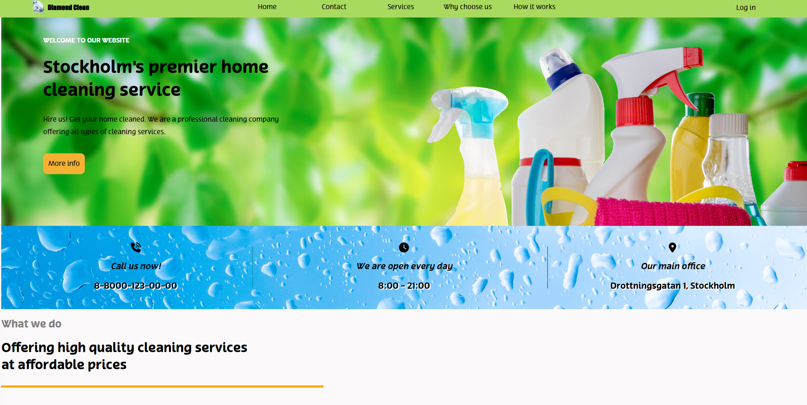
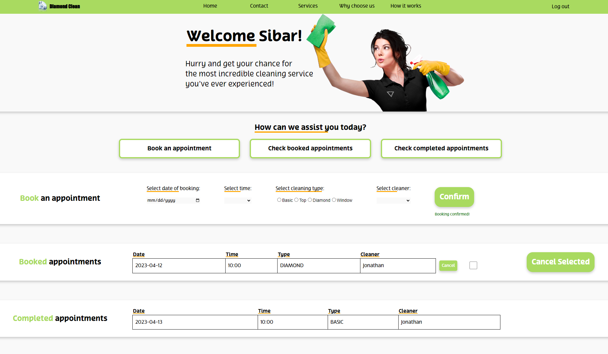
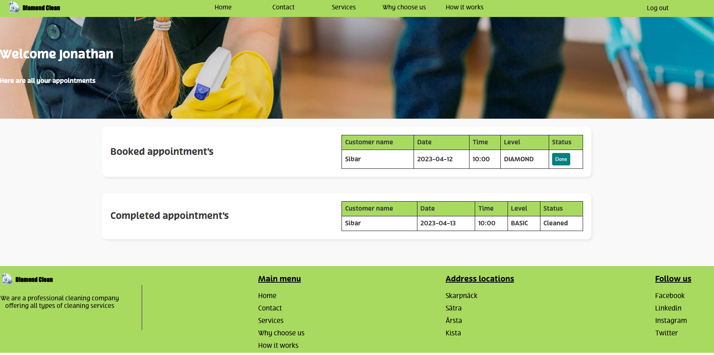

# Stadafint

 
<i> Loginpage </i>
 
 
## The project
---
Stadafint is one of our biggest project thus far.
In this project we as a group of four were tasked with making a fontend site in React with TypeScript, as well as a backend logic with help of MERN.

<i>Customers page</i>

 

---

The group were tasked to implement features taught in school and in the end have a fully functional site where the customer could book a cleaning appointment and edit it.
 
 
To also make the cleaner logic where as the cleaner would be able to see incoming jobs and past appointments.

<i>Cleaners page</i>

---

### Tools used:
In this project we touched upon tools like:

useState, useParams, axios, props, useNavigation, context and more.
